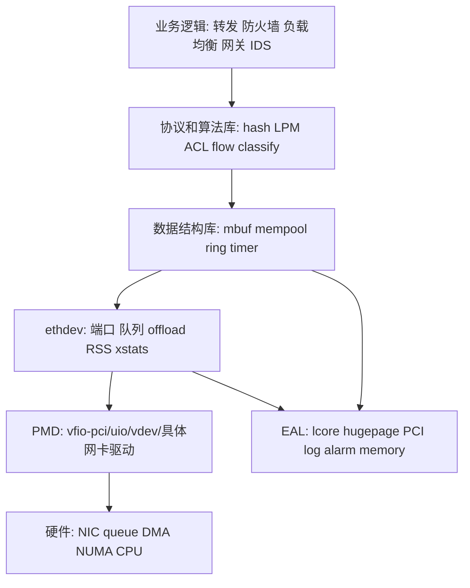
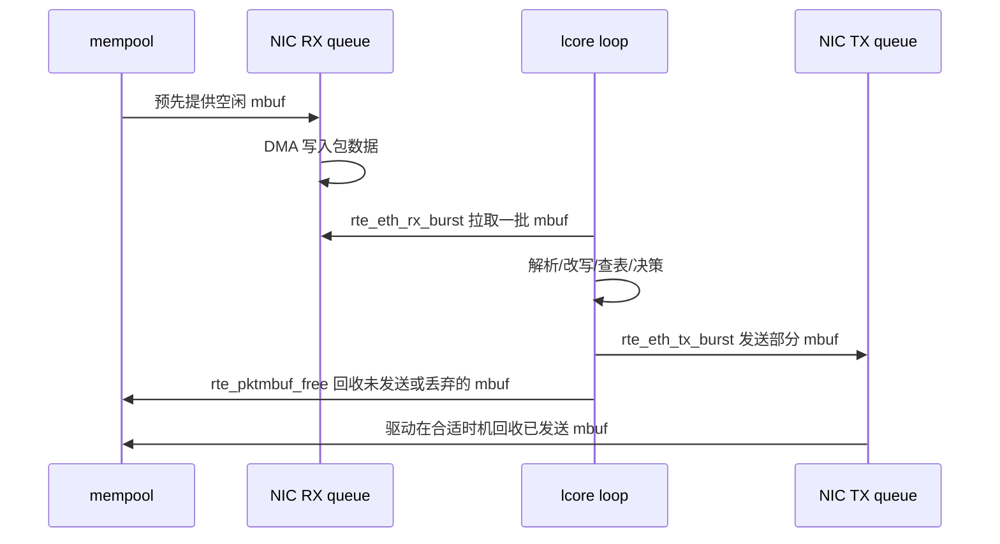

# DPDK 总览与适用场景

> 先建立全局地图：DPDK 为什么存在、由哪些核心组件构成、什么时候该用，什么时候不该用。

## 1. DPDK 到底解决什么问题

传统 Linux 网络收包通常会经过网卡中断、内核驱动、协议栈、socket 缓冲区、系统调用、用户态拷贝等路径。这个模型通用、稳定、生态好，但当你的目标是每秒处理几千万个小包时，瓶颈会集中在几个地方：

- 中断和上下文切换过多。
- 内核态和用户态之间的边界成本过高。
- 包数据在多个缓冲区之间拷贝。
- 通用协议栈做了很多你的业务可能并不需要的判断。
- CPU cache、NUMA、队列和内存布局没有被应用精确控制。

DPDK 的核心思路是把高速数据面搬到用户态：

- 使用轮询模式驱动，也就是 Poll Mode Driver，应用线程主动从网卡队列批量取包。
- 使用 hugepage 支撑的大块内存，降低 TLB 压力，并让 DMA 更容易工作。
- 使用 `mbuf` 描述包，使用 `mempool` 高速分配和回收包缓冲。
- 使用 `ring`、hash、LPM、timer 等库构建无锁或低锁的数据面组件。
- 通过 EAL 抽象 CPU、内存、PCI 设备、日志、定时器、启动参数和多进程能力。
- 通过 ethdev API 统一控制不同厂商 NIC 的端口、队列、offload、RSS、统计和链路状态。

用一句话概括：DPDK 把“网卡收发包”变成了用户态程序可直接调度的高性能循环。

## 2. DPDK 架构总览

从开发者视角看，一个 DPDK 应用一般由这些层组成：

### 2.1 EAL 是地基

EAL 是 Environment Abstraction Layer。它负责把底层环境整理成 DPDK 应用能统一使用的资源：

- 解析 EAL 参数，例如核心绑定、设备白名单、hugepage、日志级别。
- 初始化 hugepage 内存、memzone、malloc heap、IOVA 映射等。
- 探测 PCI 设备和虚拟设备。
- 启动 lcore 工作线程，并把线程绑定到指定逻辑核。
- 提供日志、panic、trace、原子操作、spinlock、定时 alarm 等基础能力。
- 支持 primary/secondary 多进程模型。

DPDK 程序通常先调用 `rte_eal_init(argc, argv)`。在它之前，你还只是一个普通 Linux 进程；在它之后，DPDK 的 CPU、内存、设备和日志环境才算可用。

### 2.2 PMD 是用户态驱动

PMD 是 Poll Mode Driver。传统驱动更依赖中断，而 PMD 的典型路径是应用线程不断调用 `rte_eth_rx_burst()` 从 RX queue 拉包，再调用 `rte_eth_tx_burst()` 发包。

轮询不是为了“忙等好看”，而是为了稳定延迟和批处理吞吐：

- 一次拉一批包，摊薄函数调用和 PCI 访问成本。
- 避免高包速下频繁中断。
- 让应用自己决定每个 lcore 处理哪些队列。
- 更容易做 cache 友好的流水线。

代价也很直接：核心会长期被占用，空闲时也可能消耗 CPU。生产环境通常会结合 power management、interrupt mode、eventdev 或自定义 idle 策略控制功耗。

### 2.3 ethdev 是网卡编程统一入口

不同厂商网卡细节差异很大，但 DPDK 应用不应该到处写具体驱动代码。ethdev 把常见能力抽象成统一 API：

- 枚举端口：`rte_eth_dev_count_avail()`、`RTE_ETH_FOREACH_DEV(port_id)`。
- 读取能力：`rte_eth_dev_info_get()`。
- 配置端口：`rte_eth_dev_configure()`。
- 配置 RX/TX queue：`rte_eth_rx_queue_setup()`、`rte_eth_tx_queue_setup()`。
- 启停端口：`rte_eth_dev_start()`、`rte_eth_dev_stop()`、`rte_eth_dev_close()`。
- 收发包：`rte_eth_rx_burst()`、`rte_eth_tx_burst()`。
- 统计：`rte_eth_stats_get()`、xstats、queue stats。
- offload：checksum、TSO、VLAN、RSS、timestamp 等。

### 2.4 mbuf、mempool、ring 是数据面的三件套

`mbuf` 是包的描述符和数据缓冲封装。它记录包长度、当前数据指针、协议类型、offload 标志、分段链表等信息。

`mempool` 是固定大小对象池。最常见用法是创建一批 `rte_mbuf` 对象，让 RX 队列、业务逻辑和 TX 队列高速复用。

`ring` 是 lockless 队列，常用于 lcore 之间传递指针，例如把收包线程收到的 `mbuf` 交给另一个处理线程。

典型生命周期如下：

## 3. 什么时候该用 DPDK

适合使用 DPDK 的场景：

- L2/L3 转发、NAT、隧道网关、负载均衡。
- 防火墙、ACL、DDoS 清洗、IDS/IPS 前置流量处理。
- 高频交易、低延迟行情接收。
- 存储网络、RDMA 辅助数据面、虚拟交换机。
- NFV、vRouter、vSwitch、SmartNIC 控制配合。
- 自研协议或绕过通用协议栈的专用网络设备。

不一定适合的场景：

- 普通 Web 服务，瓶颈在业务、数据库或 TLS，而不是包收发。
- 需要完整内核 TCP/IP 协议栈语义，又不想维护用户态协议栈。
- 运维团队无法接受网卡脱离内核管理。
- 包速不高，socket、epoll、io_uring、XDP 已经足够。
- 需要大量复用 Linux 内核网络能力，例如 iptables、tc、路由、conntrack。

简单判断方法：

| 问题 | 如果答案是“是” | 倾向 |
| --- | --- | --- |
| 每秒要处理百万到千万级小包吗 | 是 | DPDK 值得评估 |
| 延迟抖动比平均延迟更重要吗 | 是 | DPDK 值得评估 |
| 能独占 CPU core 和 NIC queue 吗 | 是 | DPDK 更容易发挥 |
| 需要完整 TCP 协议栈吗 | 是 | 先评估用户态协议栈成本 |
| 运维希望仍用 Linux 管理网卡 IP 吗 | 是 | 考虑 AF_XDP、XDP 或 bifurcated driver |
