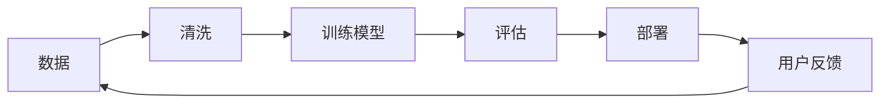

# 01 人工智能是什么

> 人工智能听起来很大，但入门时先把它看成一句话：让机器完成原本需要人类判断、学习或生成的任务。

## 一句话

人工智能是目标，机器学习是方法，深度学习是机器学习的一类方法，大模型是深度学习发展出来的一类强大模型。

```text
人工智能 AI
└── 机器学习 Machine Learning
    └── 深度学习 Deep Learning
        └── 大模型 Large Models
```

## 四个概念

| 概念 | 简单理解 | 例子 |
| --- | --- | --- |
| 人工智能 | 让机器表现出智能行为 | 聊天、识图、下棋、推荐 |
| 机器学习 | 让机器从数据中学规律 | 房价预测、垃圾邮件识别 |
| 深度学习 | 用多层神经网络学习复杂规律 | 图像识别、语音识别 |
| 大模型 | 参数很多、数据很多、能力泛化更强的模型 | 文本生成、代码辅助、多模态理解 |

## 传统程序和机器学习的区别

传统程序更像“人告诉机器规则”。

```text
人写规则
  + 输入
  = 输出

例子：如果分数 >= 60，就判定及格。
```

机器学习更像“机器从例子里总结规则”。

```text
大量例子
  + 对应答案
  = 学出规律

例子：给很多房子的信息和成交价，让模型学会估价。
```

## 模型是什么

模型可以理解为一个“会调整的函数”。

```text
输入 x  ->  模型 f  ->  输出 y
```

比如房价预测：

```text
房屋面积、位置、楼层、年份  ->  模型  ->  预测价格
```

模型一开始不会预测，训练之后才逐渐变准。

## AI 常见任务

| 任务 | 输入 | 输出 |
| --- | --- | --- |
| 回归 | 房屋信息 | 一个数值，比如价格 |
| 分类 | 邮件内容 | 垃圾邮件或正常邮件 |
| 聚类 | 用户行为 | 相似用户分组 |
| 推荐 | 用户历史 | 可能喜欢的商品 |
| 生成 | 提示词 | 文本、图片、代码 |
| 检索 | 问题 | 相关文档或片段 |

入门时最重要的是分清：这个问题到底要预测数值、预测类别，还是生成内容。

## AI 系统不等于只有模型

真实 AI 系统通常由很多部分组成：



模型只是中间的一块。数据质量、评估方式、部署环境、反馈机制都会影响效果。

## AI 能做什么，不能做什么

| 能做 | 不擅长或需要小心 |
| --- | --- |
| 从大量样本中找规律 | 没见过或数据很少的情况 |
| 快速处理重复判断 | 需要强责任判断的场景 |
| 生成文本、图片、代码草稿 | 保证事实完全正确 |
| 辅助搜索、分类、预测 | 替代人类最终负责 |

一句话：AI 是强大的工具，不是不会犯错的真理机器。

## 小结

- AI 是大目标，机器学习是实现 AI 的常见方式。
- 机器学习不是手写规则，而是从数据中学规则。
- 模型可以理解为输入到输出之间的函数。
- AI 系统不仅有模型，还有数据、训练、评估、部署和反馈。
- 学 AI 的第一步，是看清任务的输入和输出。

下一篇看机器学习的完整流程：一个模型从无到有是怎么被训练出来的。

