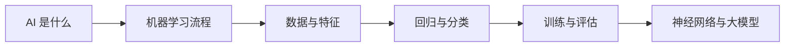

# 人工智能

> 这一组笔记不追求一上来把概念讲全，而是先建立直觉：人工智能到底在做什么，机器学习怎么学，模型为什么会变好，又为什么会犯错。

## 学习路线



## 目录

- [01 人工智能是什么](01_人工智能是什么.md)
- [02 机器学习的基本流程](02_机器学习的基本流程.md)
- [03 数据与特征](03_数据与特征.md)
- [04 回归与分类](04_回归与分类.md)
- [05 训练评估与过拟合](05_训练评估与过拟合.md)
- [06 神经网络与大模型](06_神经网络与大模型.md)

## 先抓住一句话

人工智能不是让机器“真的像人一样思考”，而是让机器从数据、规则或反馈中学会完成任务。

```text
传统程序：人写规则 + 输入数据 -> 输出结果
机器学习：输入数据 + 正确结果 -> 学出规则
```

## 这组笔记怎么读

- 先理解任务：预测价格、识别图片、生成文本，本质都是什么输入到什么输出。
- 再理解数据：模型学到的东西，取决于它见过什么数据。
- 然后理解训练：训练就是不断调整参数，让预测越来越接近答案。
- 最后理解边界：模型不是万能的，会过拟合、会偏见、会幻觉，也需要评估和约束。

