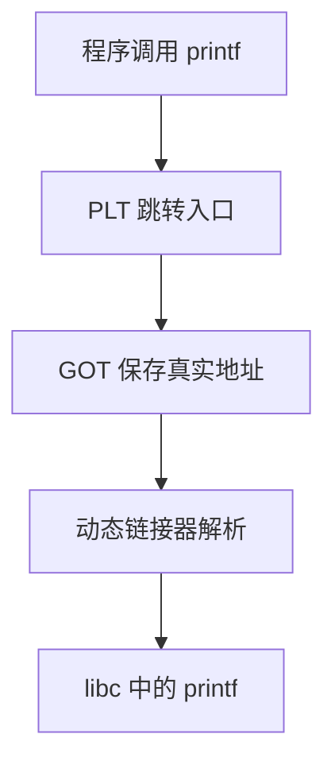

# 01 可执行文件与装载

> 学二进制安全，第一步不是漏洞，而是先知道一个程序“长什么样”。程序在磁盘上是可执行文件，运行时会被操作系统装进内存。

!!! warning "学习边界"
    本专题只用于课程实验、CTF、靶场、自有程序分析和授权测试。不要把这些知识用于未授权目标。

## 一句话

可执行文件就是一份“程序说明书”：里面写着代码在哪里、数据在哪里、需要哪些库、入口地址在哪里。操作系统按这份说明书把程序加载进内存，然后把 CPU 交给入口点。


## 文件里有什么

不同系统有不同格式：

| 系统 | 常见格式 | 可以简单理解为 |
| --- | --- | --- |
| Linux | ELF | Linux 程序的包装盒 |
| Windows | PE | Windows 程序和 DLL 的包装盒 |
| macOS | Mach-O | macOS 程序的包装盒 |

本文用 ELF 举例，但核心思想通用。

## ELF 的三层视角

看 ELF 时，不要一上来背字段。先记住三件事：

| 视角 | 关心什么 | 给谁看 |
| --- | --- | --- |
| ELF Header | 文件类型、架构、入口地址 | 操作系统 |
| Section | 代码、字符串、符号等“细分类” | 链接器、逆向分析者 |
| Segment | 哪些内容要映射进内存、权限是什么 | 装载器 |

```text
磁盘上的 ELF 文件
┌────────────────────┐
│ ELF Header          │ 入口地址、架构、表位置
├────────────────────┤
│ Program Headers     │ Segment 信息：装载时看它
├────────────────────┤
│ .text               │ 机器指令
├────────────────────┤
│ .rodata             │ 只读字符串、常量
├────────────────────┤
│ .data               │ 已初始化全局变量
├────────────────────┤
│ .bss                │ 未初始化全局变量，只记录大小
├────────────────────┤
│ .symtab / .dynsym   │ 符号信息
└────────────────────┘
```

## 常见节

| 名称 | 放什么 | 安全分析时看什么 |
| --- | --- | --- |
| `.text` | 程序指令 | 是否可执行、是否有可复用代码片段 |
| `.rodata` | 常量字符串 | 命令、路径、格式化字符串、提示信息 |
| `.data` | 已初始化全局变量 | 全局状态、函数指针、配置 |
| `.bss` | 未初始化全局变量 | 全局缓冲区、越界写风险 |
| `.plt` / `.got` | 动态链接跳转表 | 外部函数如何被调用 |
| `.dynsym` | 动态符号 | 程序依赖哪些库函数 |

一个朴素判断：`.text` 是“会执行的”，`.data/.bss` 是“会被改的”，`.rodata` 是“通常只读的”。

## 从文件到内存

程序运行时，操作系统不会把整个文件随便塞进内存，而是按 Segment 映射。

```text
磁盘文件                         进程虚拟内存
┌──────────────┐                 ┌──────────────────┐
│ LOAD RX      │  ────────────>  │ 代码段 r-x       │
│ .text .rodata│                 │ 指令、只读常量   │
├──────────────┤                 ├──────────────────┤
│ LOAD RW      │  ────────────>  │ 数据段 rw-       │
│ .data .bss   │                 │ 全局变量         │
└──────────────┘                 └──────────────────┘
```

权限里的三个字母很重要：

| 权限 | 含义 |
| --- | --- |
| `r` | 可读 |
| `w` | 可写 |
| `x` | 可执行 |

安全上最理想的状态是：代码可执行但不可写，数据可写但不可执行。

## 动态链接

很多程序不会把所有库代码都放进自己文件里，而是在运行时加载共享库，比如 `libc.so`。



简单理解：

- `PLT` 像“中转站”。
- `GOT` 像“电话簿”，记录外部函数的真实地址。
- 动态链接器负责第一次调用时把地址填好。

这些表和地址在漏洞利用、防护机制里经常出现，所以先混个脸熟。

## 装载的大致过程

1. 用户运行程序。
2. 内核读取可执行文件头。
3. 内核把需要的 Segment 映射到虚拟内存。
4. 动态链接器加载依赖库。
5. 初始化运行环境，比如参数、环境变量、栈。
6. 跳到入口地址开始执行。

```text
execve()
  ↓
读取 ELF Header
  ↓
映射代码段 / 数据段
  ↓
加载动态链接器和共享库
  ↓
准备栈：argc、argv、envp
  ↓
跳转到入口点
```

## 为什么安全要从这里开始

很多安全现象都和可执行文件结构有关：

| 现象 | 和可执行文件的关系 |
| --- | --- |
| 代码注入困难 | 数据区通常没有 `x` 权限 |
| ROP 可行 | `.text` 和共享库里有现成指令片段 |
| 地址随机化 | 装载时改变代码、库、栈、堆位置 |
| 动态函数劫持 | GOT/PLT 参与外部函数调用 |
| 逆向定位逻辑 | 字符串、符号、节信息能帮助分析 |

## 快速看一个程序

常用命令不需要全背，先知道看什么：

```bash
file ./a.out          # 看文件类型和架构
readelf -h ./a.out    # 看 ELF 头
readelf -S ./a.out    # 看 Section
readelf -l ./a.out    # 看 Segment 和权限
objdump -d ./a.out    # 反汇编代码段
```

## 小结

- 可执行文件是程序在磁盘上的组织形式。
- Section 更适合分析，Segment 更接近装载。
- `.text` 放代码，`.rodata` 放常量，`.data/.bss` 放全局变量。
- 操作系统按权限把程序映射到虚拟内存。
- GOT/PLT 和动态链接是后续理解利用与防护的重要基础。

下一篇进入虚拟内存：程序运行后，地址到底是什么意思？

