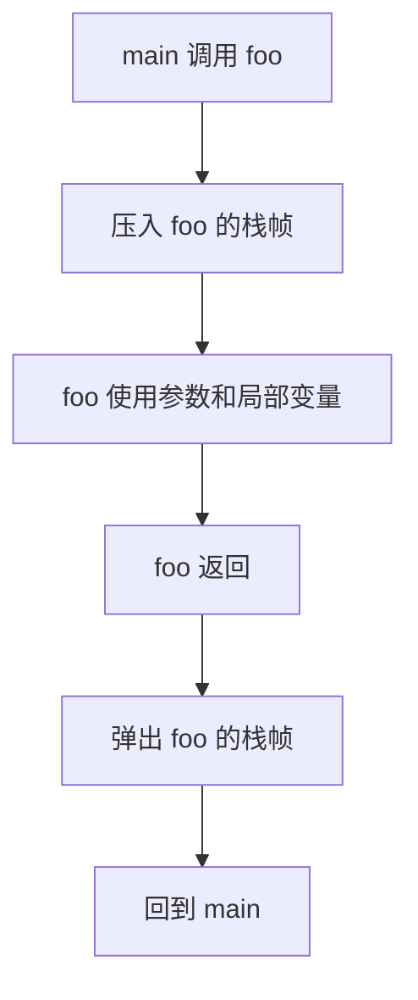

# 03 栈与函数调用

> 栈保存函数调用现场。看懂栈，就能看懂很多崩溃、递归、局部变量、返回地址和栈溢出的根源。

## 一句话

栈像一摞临时便签：每调用一个函数，就压上一张便签；函数返回，就把这张便签拿走。



## 栈的方向

在常见 x86/x86-64 环境中，栈通常向低地址增长。

```text
高地址
┌──────────────────┐
│ 更早的栈帧        │
├──────────────────┤
│ 当前函数栈帧      │
├──────────────────┤
│ 新压入的数据      │
└──────────────────┘
低地址  ↑ 栈增长方向
```

不要死记所有平台细节，先记住核心：栈是函数调用的临时工作区。

## 一个栈帧里有什么

栈帧是某个函数运行时在栈上的那一块区域。

```text
高地址
┌────────────────────┐
│ 调用者的数据        │
├────────────────────┤
│ 返回地址            │ 函数结束后回到哪里
├────────────────────┤
│ 保存的旧帧指针      │ 帮助恢复调用者栈帧
├────────────────────┤
│ 局部变量            │ int x; char buf[16];
├────────────────────┤
│ 临时数据            │ 编译器生成的中间值
└────────────────────┘
低地址
```

最关键的是返回地址。它决定函数执行完以后跳回哪里。

## 调用和返回

以 `main -> foo -> bar` 为例：

```text
main()
  └── foo()
        └── bar()
```

运行到 `bar` 时，栈大致是：

```text
高地址
┌──────────────┐
│ main 栈帧     │
├──────────────┤
│ foo 栈帧      │
├──────────────┤
│ bar 栈帧      │ 当前正在执行
└──────────────┘
低地址
```

`bar` 返回后，`bar` 的栈帧被移除，CPU 根据返回地址回到 `foo`。

## 参数放在哪里

参数可能放在寄存器，也可能放在栈上，取决于架构和调用约定。

| 场景 | 常见做法 |
| --- | --- |
| x86-64 Linux 前几个整数/指针参数 | 多数放寄存器 |
| 参数太多 | 多出来的放栈上 |
| 局部数组、结构体、临时数据 | 通常在栈帧里 |

学习漏洞时，不必一开始背全 ABI。先能从调试器里看懂“返回地址、局部变量、栈顶”即可。

## 栈溢出是什么

栈溢出通常是：向栈上的缓冲区写入超过容量的数据，覆盖了旁边的内容。

```c
void hello(char *name) {
    char buf[16];
    strcpy(buf, name); // name 太长时会越界
}
```

直观看：

```text
正常情况
┌──────────────┐
│ 返回地址      │
├──────────────┤
│ 旧帧指针      │
├──────────────┤
│ buf[16]      │ "Alice"
└──────────────┘

输入过长
┌──────────────┐
│ 返回地址      │ <- 可能被覆盖
├──────────────┤
│ 旧帧指针      │ <- 可能被覆盖
├──────────────┤
│ buf[16]      │ "AAAAAAAAAAAA..."
└──────────────┘
```

危险点在于：如果返回地址被破坏，函数返回时就可能跳到错误位置。

## 两类后果

| 被覆盖的内容 | 可能后果 |
| --- | --- |
| 普通局部变量 | 程序逻辑被改坏 |
| 返回地址/函数指针 | 控制流被劫持或程序崩溃 |

并不是所有溢出都能利用。能否利用还取决于地址是否可知、防护是否开启、写入内容是否可控等条件。

## Canary：栈上的报警线

Canary 会放在局部缓冲区和关键控制数据之间。函数返回前检查它有没有被改。

```text
高地址
┌──────────────┐
│ 返回地址      │
├──────────────┤
│ 旧帧指针      │
├──────────────┤
│ Canary       │ 被改就报警
├──────────────┤
│ buf[16]      │
└──────────────┘
低地址
```

如果长输入一路覆盖过去，通常会先破坏 Canary。程序发现后直接终止，避免继续返回到异常地址。

## 看栈时抓三件事

| 你看到的东西 | 说明 |
| --- | --- |
| 栈顶指针 | 当前栈用到哪里 |
| 帧指针 | 当前函数栈帧的参考点 |
| 返回地址 | 当前函数结束后去哪里 |

调试时常见问题：

- 崩溃地址是否像一串输入字符？
- 返回地址附近是否被覆盖？
- 局部数组和返回地址相距多远？
- 程序是否启用了 Canary？

## 写代码时怎么避免

- 使用带长度限制的接口。
- 输入先检查长度，再复制。
- 不要把用户输入直接塞进固定小数组。
- 开启编译器防护：Canary、Fortify、PIE、NX。
- 能用内存安全语言或安全容器时，不手写裸缓冲区。

## 小结

- 栈保存函数调用现场。
- 栈帧里有返回地址、旧帧指针、局部变量等内容。
- 栈溢出的本质是越界写破坏相邻数据。
- 返回地址被覆盖会影响控制流。
- Canary 是栈溢出防护里的重要报警线，但不是万能防护。

下一篇看堆：动态内存为什么更灵活，也更容易出生命周期问题。

