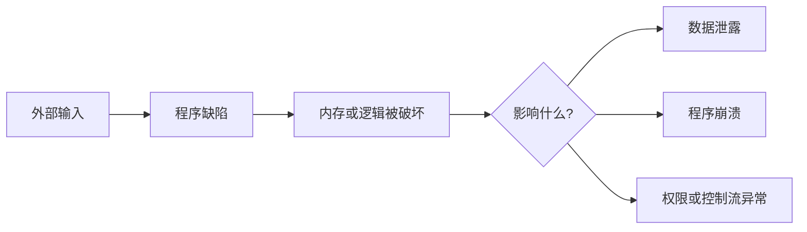
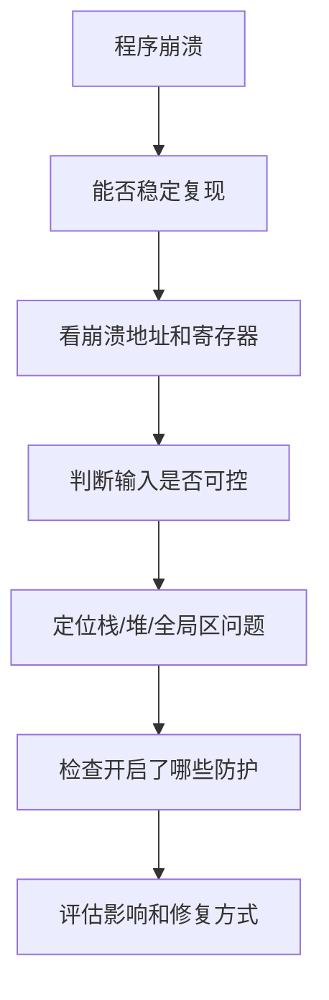

# 05 漏洞与防护基础

> 前四篇讲“程序如何存在”。这一篇讲“程序为什么会被打坏”，以及防护机制到底在保护什么。

!!! warning "仅限授权环境"
    本文只解释原理和防护思路，不提供针对真实目标的攻击步骤。实验请限制在本地靶机、CTF、课程环境或明确授权系统中。

## 一句话

漏洞利用通常不是魔法，而是三件事连起来：程序有缺陷、攻击者能控制输入、缺陷能影响敏感数据或控制流。



## 常见漏洞类型

| 类型 | 本质 | 常见后果 |
| --- | --- | --- |
| 越界读 | 读了不该读的内存 | 信息泄露、崩溃 |
| 越界写 | 写了不该写的内存 | 数据破坏、控制流异常 |
| 栈溢出 | 写出栈上缓冲区 | 覆盖局部变量、返回地址 |
| 堆溢出 | 写出堆块边界 | 覆盖相邻对象、元数据 |
| UAF | 释放后继续使用 | 读写错误对象、类型混淆 |
| Double free | 重复释放同一块内存 | 分配器状态异常 |
| 整数溢出 | 数值计算绕回 | 分配过小、边界判断失效 |
| 格式化字符串 | 把输入当格式串 | 读写异常、信息泄露 |

## 利用条件

一个漏洞要变成稳定利用，通常需要满足一些条件。

```text
可控输入
  + 可触发漏洞
  + 可观察结果
  + 可影响关键数据
  + 能绕过或避开防护
  = 才可能形成利用
```

所以看到崩溃不等于马上能利用。分析时要问：

- 输入能控制多少字节？
- 覆盖到了普通数据还是控制数据？
- 地址是否可预测？
- 内存权限是否允许执行？
- 程序是否有信息泄露？
- 防护机制是否开启？

## 控制流和数据流

很多漏洞最后影响两类东西：

| 目标 | 解释 | 例子 |
| --- | --- | --- |
| 数据流 | 改变程序用到的数据 | 把 `is_admin` 改成 true |
| 控制流 | 改变程序接下来执行哪里 | 破坏返回地址、函数指针 |

```text
数据流攻击：输入 -> 覆盖变量 -> 权限判断被绕过
控制流攻击：输入 -> 覆盖跳转目标 -> 执行路径异常
```

入门时不要只盯着“拿 shell”。很多严重漏洞只是改了一个权限字段、路径字段或长度字段。

## 防护机制在拦什么

| 防护 | 拦截点 | 主要作用 |
| --- | --- | --- |
| NX / DEP | 内存权限 | 数据页不可执行 |
| ASLR | 地址布局 | 地址难预测 |
| Stack Canary | 栈帧 | 检测连续栈溢出 |
| PIE | 可执行文件装载 | 主程序地址也随机化 |
| RELRO | 动态链接表 | 减少 GOT 被改写风险 |
| Fortify | 常见危险函数 | 增加边界检查 |
| CFI | 间接跳转 | 限制异常控制流 |
| Sandbox | 运行环境 | 限制漏洞成功后的影响 |

图像化看：

```text
攻击路径：输入 -> 越界写 -> 改返回地址 -> 跳到目标代码

Canary:      检测返回地址前的连续覆盖
NX:          阻止跳到栈/堆上的数据执行
ASLR/PIE:    让目标地址难猜
CFI:         限制跳转目标是否合法
Sandbox:     就算成功，也限制能做什么
```

## Shellcode、ret2libc、ROP 的位置

先用一句话理解，不急着深入。

| 名称 | 核心想法 | 为什么出现 |
| --- | --- | --- |
| Shellcode | 把机器指令放进内存再跳过去 | 早期数据区可执行时更直接 |
| ret2libc | 不注入代码，跳到已有库函数 | NX 让数据区不可执行 |
| ROP | 拼接程序已有小指令片段 | 进一步绕过不可执行内存 |

```text
直接注入代码：输入里带新代码 -> 跳过去执行
代码复用：不带新代码 -> 借程序/库里已有代码完成目标
```

现代系统常见的是“代码复用 + 信息泄露 + 多层绕过”的组合思路。

## 分析一个崩溃的顺序



建议先判断“是什么类型的问题”，再判断“有没有安全影响”。

## 常用分析方法

| 方法 | 用来做什么 |
| --- | --- |
| 静态阅读 | 看源码、反汇编、字符串、调用关系 |
| 动态调试 | 看运行时寄存器、栈、堆、崩溃点 |
| Sanitizer | 自动发现越界、UAF 等内存错误 |
| Fuzzing | 自动生成大量输入找崩溃 |
| 代码审计 | 从入口、边界、权限、危险函数查问题 |

工具不是重点，问题模型才是重点：输入从哪里来，流到哪里去，中间有没有校验。

## 修复比利用更重要

| 问题 | 修复思路 |
| --- | --- |
| 越界写 | 明确长度，使用安全容器和边界检查 |
| UAF | 明确所有权，释放后不再使用 |
| Double free | 统一释放责任，避免多处释放 |
| 整数溢出 | 计算前检查范围，使用安全整数库 |
| 格式化字符串 | 格式串固定，用户输入只作为参数 |
| 信息泄露 | 错误信息脱敏，初始化内存，减少地址暴露 |

最好的防护不是“漏洞后再加墙”，而是让漏洞更少出现。

## 小结

- 漏洞利用依赖可控输入、缺陷、影响目标和防护状态。
- 栈问题常影响返回地址和局部变量。
- 堆问题常围绕生命周期、复用和相邻对象。
- NX、ASLR、Canary、PIE、RELRO 等机制分别保护不同环节。
- 学软件安全要同时理解攻击路径和修复路径。

学完这 5 篇后，继续深入可以按两条线走：一条是逆向与调试，另一条是安全编码与漏洞挖掘。

